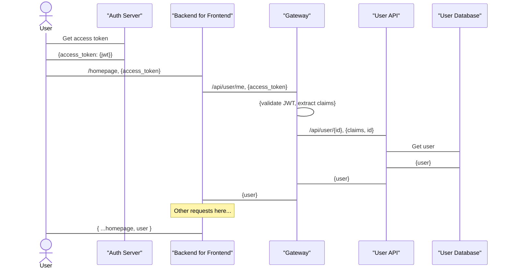

## Diagrams as Code Examples

### Draw.io/Diagrams.net

### PlantUML

### Mermaid

```mermaid
sequenceDiagram
Actor User
Participant Auth as "Auth Server"
Participant BEFE as "Backend for Frontend"
Participant GW as "Gateway"
Participant UserAPI as "User API"
Participant UserDB as "User Database"

User -> Auth: Get access token
Auth -> User: {access_token: {jwt}}
User -> BEFE: /homepage, {access_token}
BEFE -> GW: /api/user/me, {access_token}
GW -> GW: {validate JWT, extract claims}
GW -> UserAPI: /api/user/{id}, {claims, id}
UserAPI -> UserDB: Get user
UserDB -> UserAPI: {user}
UserAPI -> GW: {user}
GW -> BEFE: {user}
note over BEFE: Other requests here...
BEFE -> User: { ...homepage, user }
```
