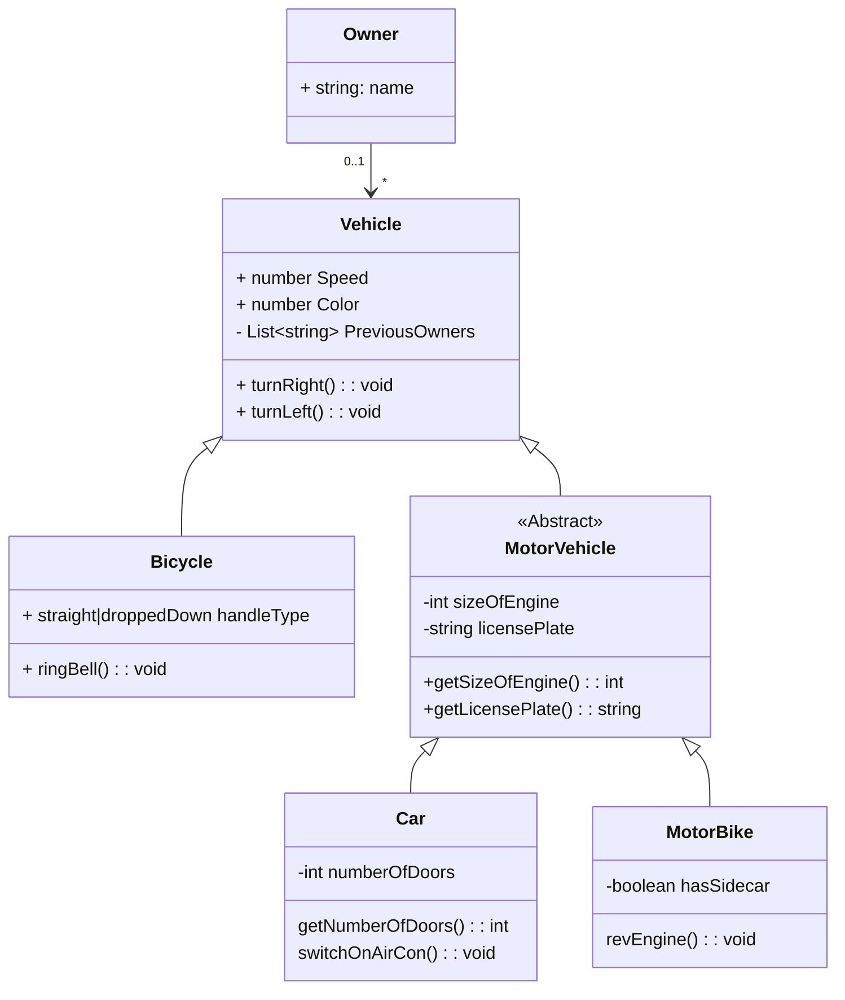

```mermaid
classDiagram
Owner "0..1" --> "*" Vehicle
Vehicle <|-- Bicycle
Vehicle <|-- MotorVehicle
MotorVehicle <|-- Car
MotorVehicle <|-- MotorBike

class Owner {
  + string: name
}

class Vehicle {
  + number Speed
  + number Color
  - List~string~ PreviousOwners
  + turnRight(): void
  + turnLeft(): void
}

class Bicycle {
  + straight|droppedDown handleType
  + ringBell(): void
}

class MotorVehicle {
<<Abstract>>
  -int sizeOfEngine
  -string licensePlate
  +getSizeOfEngine(): int
  +getLicensePlate(): string
}

class Car {
 -int numberOfDoors
 getNumberOfDoors(): int
 switchOnAirCon(): void
}

class MotorBike {
  -boolean hasSidecar
  revEngine(): void
}

```
