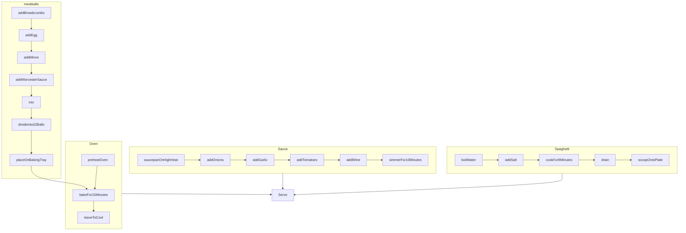

```mermaid
flowchart
    subgraph Oven
    preheatOven --> bakeFor15Minutes --> leaveToCool
    end

    subgraph meatballs
    addBreadcrumbs --> addEgg --> addMince --> addWorcesterSauce --> mix --> divideInto32Balls --> placeOnBakingTray --> bakeFor15Minutes
    end

    subgraph Sauce
    saucepanOnHighHeat --> addOnions --> addGarlic --> addTomatoes --> addWine --> simmerFor10Minutes
    end

    subgraph Spaghetti
      boilWater --> addSalt --> cookFor9Minutes --> drain --> scoopOntoPlate
    end
    Oven --> Serve
    Spaghetti --> Serve
    Sauce --> Serve
```
