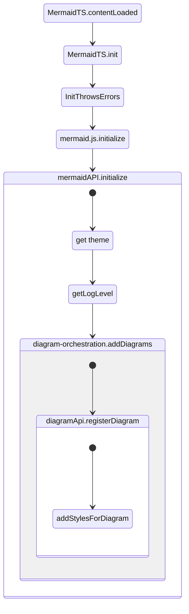

```mermaid
stateDiagram
  A: mermaid.js.initialize
  B: mermaidAPI.initialize
  C: get theme
  D: getLogLevel
  E: diagram-orchestration.addDiagrams
  F: diagramApi.registerDiagram
  G: addStylesForDiagram
  H: InitThrowsErrors
  I: MermaidTS.init
  J: MermaidTS.contentLoaded

  J --> I
  I --> H
  H --> A
  A --> B
   state B {
    [*] --> C
    C --> D
    D --> E
    state E {
      [*] --> F
      state F {
        [*] --> G
      }
    }
  }
```
