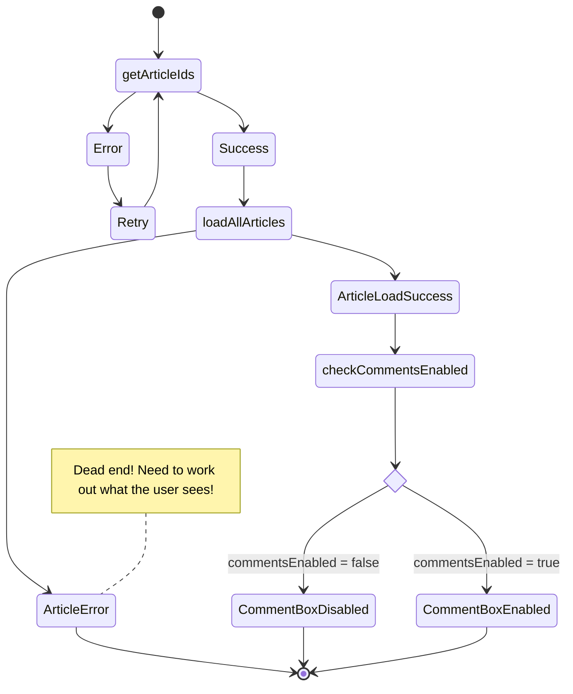

- [ ] Notes

```mermaid
stateDiagram
direction TB
[*] --> getArticleIds
getArticleIds --> Success
getArticleIds --> Error
Error --> Retry
Retry --> getArticleIds
Success --> loadAllArticles
loadAllArticles --> ArticleLoadSuccess
loadAllArticles --> ArticleError
note left of ArticleError
  Dead end! Need to work out what the user sees!
end note
ArticleError --> [*]
state if_state <<choice>>
ArticleLoadSuccess --> checkCommentsEnabled
checkCommentsEnabled --> if_state
if_state --> CommentBoxDisabled: commentsEnabled = false
if_state --> CommentBoxEnabled: commentsEnabled = true
CommentBoxDisabled --> [*]
CommentBoxEnabled --> [*]
```
